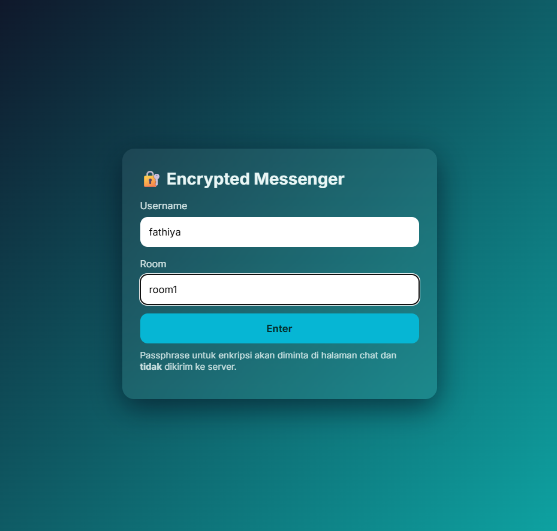
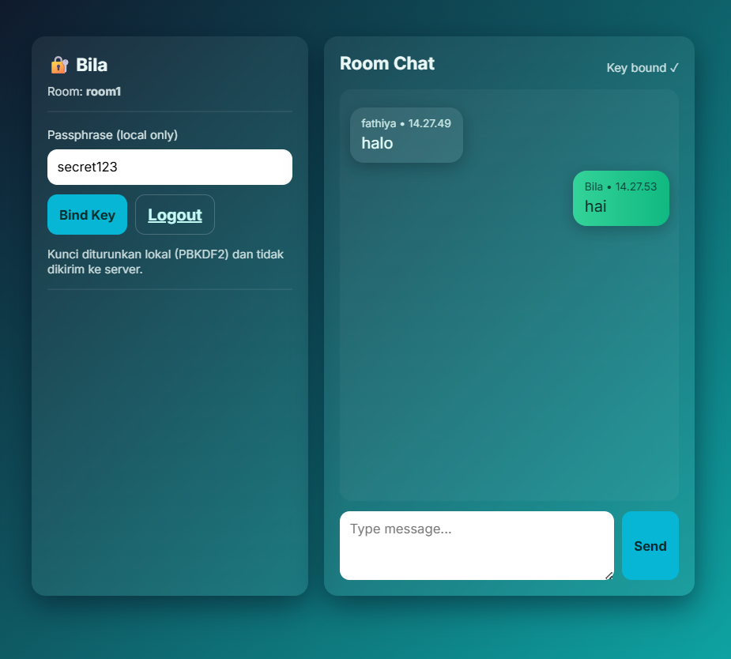
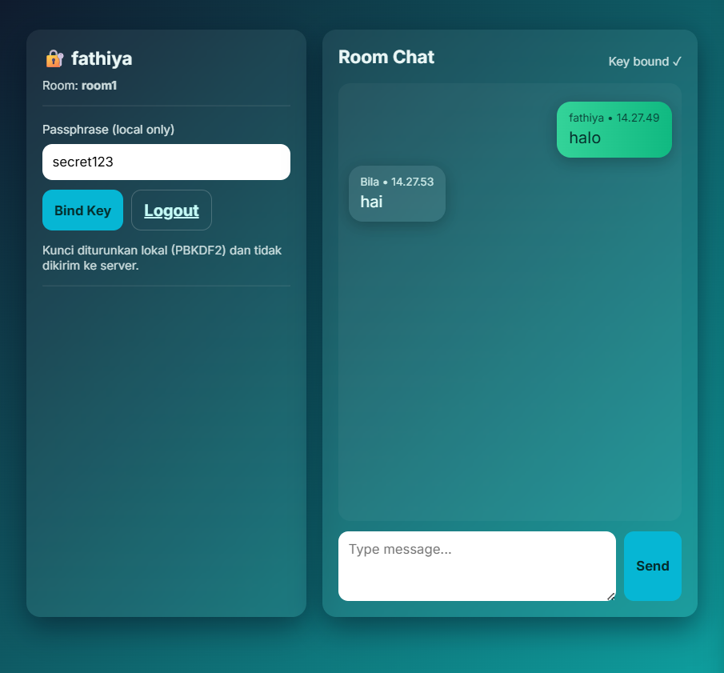
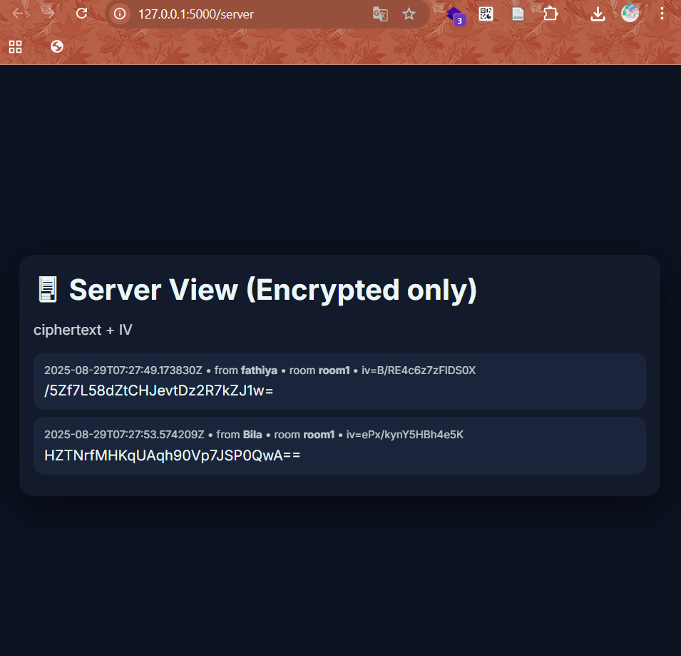

# 🔐 Mini Chat App (E2EE) using AES

A simple end-to-end encrypted (E2EE) chat application built with **Python (Flask)** for the backend and **HTML, CSS, JS** for the frontend.  
Messages are encrypted locally in the browser using **AES-GCM** with keys derived from a shared passphrase (**PBKDF2**).  
The server only stores encrypted messages, ensuring privacy.

---

## 📑 Table of Contents
- [✨ Features](#-features)  
- [🛠️ Tech Stack](#️-tech-stack)  
- [🔐 How Encryption Works](#-how-encryption-works)  
- [🚀 How to Run](#-how-to-run)  
- [📸 Preview](#-preview)  

---

## ✨ Features
- 🔑 **End-to-End Encryption** — Messages are encrypted before leaving the browser.  
- 💬 **Real-time Messaging** — Auto-refreshing chat view.  
- 🖥 **Two-sided UI** — Pov between two side of senders.  
- 🔍 **Server View Mode** — To see raw encrypted messages on server pov.

---

## 🛠 Tech Stack
- **Frontend**: HTML, CSS, JS
- **Backend**: Python (Flask)
- **Encryption**: WebCrypto API (AES-GCM, PBKDF2)

---

## 🔐 How Encryption Works
1. User enters a **shared passphrase** (local only).  
2. App derives an **AES-256-GCM key** using **PBKDF2** with the passphrase.  
3. Before sending, the message is **encrypted locally** with AES-GCM.  
4. Server stores **only ciphertext + IV**, never the plaintext.  
5. Receiver decrypts the ciphertext locally with the same passphrase.  

---

## 🚀 How to Run
1. Clone the repo:  
   ```bash
   git clone https://github.com/your-username/e2ee-chat-app.git
   cd e2ee-chat-app
2. Install dependencies
3. Run the server (app.py)
4. Open in browser
5. Enter username & room name
6. Bind a shared passphrase with chat partner
7. start sending encrypted messages

---
## 📸 Preview
### Login


### Chat interface



### Server View



